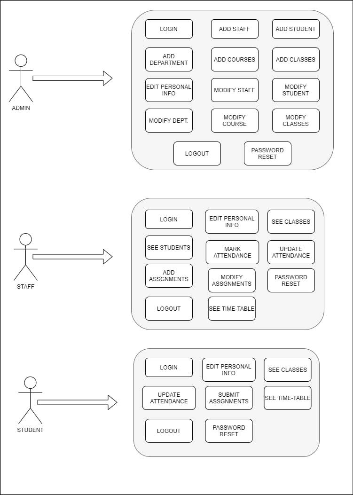
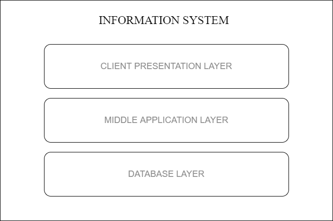

gm

# CUMS_DBMS
🏰 A College Management Site (DBMS) using Node and Mysql.

A college management system (web application) that provides complete funtionality to manage enrollment, students, faculty, attendance, fees, scheduling,
assignments and grades for a particular college.It uses Node.js for backend and MySql as Database.

The purpose of this application is to automate the existing manual system by the help of computerized equipment and full-fledged computer software, fulfilling their requirements, so that their valuable data/information can be stored for a longer period with easy accessing and manipulation of the same. The required software and hardware are easily available and easy to work with.

**SEE THE COMPLETE REPORT HERE** [Report](docs/CMSNSIT_Report.pdf)

## Product Features and User Classifications

There are several types of end users for the CMS. They are broadly divided as Students, Staff and the Administrator. Each of these classes have their own set of features

- **ADMIN** who can view and edit the details of any students/staff. Can add/edit departments, courses, classes and time-tables.
- **STAFF** who can view students details, add/update assignments, marks and attendance of a particular student.   They can see the time-table of a particular class also.
- **STUDENT** who can update profile/ add solution to assignments and see marks/attendance.

## System Design

### UseCase Diagram 

This is the use case diagram which depicts the user’s interaction with the system. It also shows the relationship between the user and the different use cases in which the user is involved.

### Database Design 

We are using MySQL as our database. The main objective of this project is to use Relational Database and hence MySQL is the best choice for that. 

*User can perform the above operations without writing any database query by using our simple and convenient User Interface.*

**CLASS DIAGRAM**

**ER MODEL**

### 3-tier Architecture

-------------------------------------------------------------------------------

**SEE THE COMPLETE REPORT HERE** [Report](docs/CMSNSIT_Report.pdf)

## Setting up Project

* Open Terminal and execute 
    `https://github.com/Vishal1003/CUMS_DBMS.git`
    `cd CUMS_DBMS`
    `npm install`
* Create following env variables (in order to connect to database and use JWT) :
  * DB_HOST
  * DB_USER
  * DB_PASS
  * PORT
  * JWT_SECRET
  * JWT_EXPIRE
  * SESSION_SECRET
* For setting up mail-gun Go to official doc of mail-gun. Sign up and replace your credentials here.
  * URL
  * RESET_PASSWORD_KEY
  * DOMAIN_NAME
  * MAILGUN_API_KEY
* Create the database using following query in mysql : `CREATE DATABASE databasename;`
* Create tables using the sql script file in `databse/cms.sql`;
* To seed data in the database run to file in `seed` folder
* To start the application execute `npm start`

